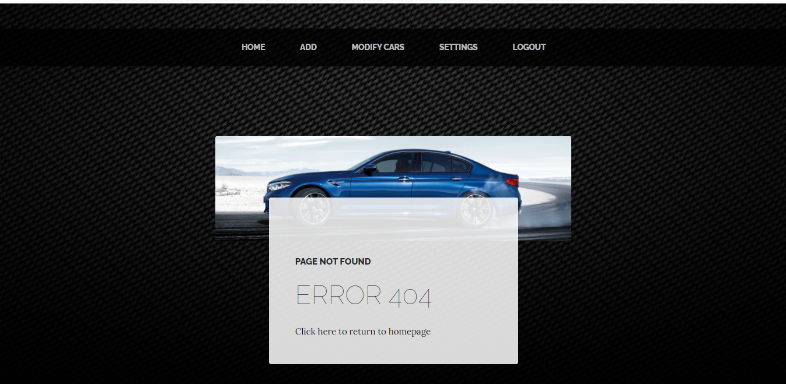
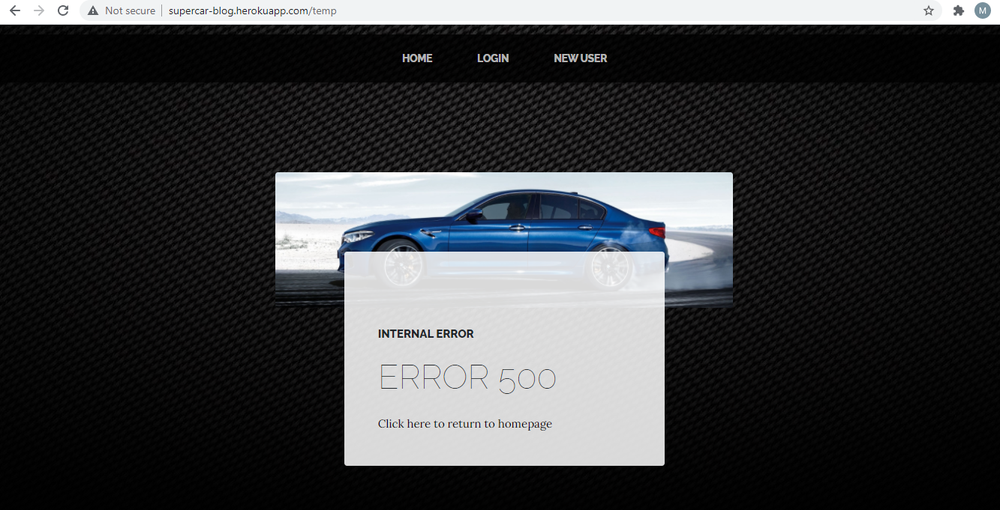

# Milestone Project 3 - Supercar Spotting - by Matt Green

My third project was to create an Data Centric website.  

I have chosen to design a website for car enthusiasts, which is like a blog that users can create read update and delete information.

 _**You can access the completed website by [clicking here](https://supercar-blog.herokuapp.com) :rocket:**_

The website was created using HTML5, CSS, Javascript, JQuery, Python, MongoDB and external Libraries and Frameworks

The website has been designed and tested to be fully functional on all devices, including a drop-down mobile navigation menu for smaller devices.

 
## Contents Page

* [1. UX - User Experience](#1-ux---user-experience)
* [2. Features](#2-features)
* [3. Technologies Used](#3-technologies-used)
* [4. Testing](#4-testing)
* [5. Deployment](#5-deployment)
* [6. Credits](#6-credits)

## 1. UX - User Experience 
 
- The Website is predominantly designed for car spotters, but it can be used by anyone with an interest in cars.  
- The user is able to create, update and delete their own posts on car spotting, and read other users' posts.
- The user is able to search for posts, and with administrator rights they can also modify car makes.  
- The user is able to create an account, log in, log out, change their password, and delete their account. 
- The website is very eye-catching as an external library was used to aid appearance.

**User Stories**

- As a user, I want the website layout to be clear and concise.
- As a user, I want the colours to be appealing but also easy on the eye.
- As a user, I want the navigation to be easy to use, and for me not to get lost in the website.
- As a user, I want all the links to work correctly.
- As a user, I want the website to be very interactive.
- As a user, I don't want too much text to scroll through.
- As a user, I want all the information to be easy to find.
- As a user, I want all the images to be clear, not pixelised.
- As a user, I want the search bar to work correctly, and if no information to inform me that no results are found.
- As a user, I want to be able to create, read, update and delete required information.
- As a user, I want to see the correct information, and not find any veriations of date formats, car makes, or country names - to avoid confusion.
- As a user, I want the website to be secure, that my password cannot be found, and no one can delete my posts except the administrator and me.
- As a user, I want to be able to change my password or delete my account.
- As a user, I want the content to adjust automatically when using multiple screen sizes and devices.

**Design**

This project was designed with Balsamiq Wireframes, which can be seen below:

As my project was based on Data Centric rather than Front End, I used a Library from [StartBootstrap](https://startbootstrap.com/)

**Accessibility**

The project has many features such as:

* Fall-back fonts, in case Google Fonts are not compatible with the browser - built in with the library
* Alternate Text' attributes for images, in case the images do not display

* @media Queries, to modify content to fit different sized screens

## 2. Features

The main features of this project are:
 
- Simplistic Colour Design (black/grey/orange) - allows users to see and process information more easily, as the colours are much more appealing to the eye. 
- Stylish Font Theme - more appealing to the eye, ready built in with the library.
- Navigation Menu - allows users switch between pages. Menu options change depending on whether logged in, logged out, or admin user.
- Mobile Navigation Menu - allows users to save screen space on Mobile Devices by using an animated dropdown menu, using well known 'hamburger' icon, so users can see more content.
- Fade effect - a lot of the content (including mobile navigation menu) has opacity background, to add style.
- Search bar - to make it easier to find posts when lots of data

**Search Bar**

The search bar was made with the help of [W3 Schools](https://www.w3schools.com/howto/howto_css_animated_search.asp).

On smaller screens the size reduces to prevent any issues dispaying.  

There is an undo button to refresh the page, if the user wishes to see all posts again.

**Error 404 Page**

In case the user enters a page which does not exist, they will be redirected to an Error 404 page, that has the link to homepage.

**Error 500 Page**

As it is a database, in case there is any other issues on the site, the user will be redirected to an Error 500 page, that has the link to homepage.

### Features Left to Implement

- Some more settings in the 'account settings' page, such as modify username, add email, profile picture
- For creating a user, and changing password - the option to reconfirm the password (verify)
- An option to upload a picture of the car in each post
- When administrator edits an account, for the 'posted by' to not change to 'admin123'
- An option when deleting a post, or the account - to say 'are you sure you want to delete?'

## 3. Technologies Used

In order to construct this project, the below technologies were used: 

- [Gitpod IDE](https://gitpod.io)
    - The project uses **Gitpod IDE** with build in Bash CLI to write and push code to GitHub.
- [HTML5](https://html.spec.whatwg.org)
    - The project uses **HTML5** to create the basic structure, text, images and other elements.
- [CSS3](https://www.w3.org/Style/CSS/specs.en.html)
    - The project uses **CSS3** to add customised style to the webpage.
- [JQuery](https://jquery.com)
    - The project uses **JQuery** with Javascript to add additional interactive features, such as the datepicker and dropdown menus.
- [StartBootstrap Library](https://startbootstrap.com)
    - The project uses **StartBootstrap** as a library for displaying an appealing html/css template.
- [Python](https://www.python.org)
    - The project uses **Python** as one of the main programming languages in the app.
- [Materialize](https://materializecss.com/)
    - The project uses **Materialize** to add additional features such as input fields.
- [MongoDB](https://jquery.com)
    - The project uses **MongoDB** as a database to create, read, update and delete the information passed to and from the app.
- [Jinja](https://www.json.org)
    - The project uses **Jinja** to generate rendered HTML using python.
- [Werkzeug](https://werkzeug.palletsprojects.com/)
    - The project uses **Werkzeug** for security features, such as PasswordHash.
- [PyMongo](https://pypi.org/project/pymongo/)
    - The project uses **PyMongo** for tools to interact with MongoDB from Python.
- [FontAwesome](https://cdnjs.com/libraries/font-awesome)
    - The project uses **FontAwesome** for icons.
- [Heroku](https://www.heroku.com/)
    - The project uses **Heroku** to display the app to the user.   
- [Balsamiq WireFrames](https://balsamiq.com/wireframes/desktop)
    - The project uses **Balsamiq WireFrames** to generate a digital prototype of the webpage before coding.
- [Responsive Viewer Extension - Chrome](https://chrome.google.com/webstore/detail/responsive-viewer/inmopeiepgfljkpkidclfgbgbmfcennb?hl=en)
    - The project uses **Responsive Viewer Extension - Chrome** to easily test the webpage on multiple sized devices at once.
- [HTML5 Validator](https://validator.w3.org)
    - The project uses **HTML5 Validator** to check all the HTML5 code is working, without any errors.
- [CSS3 Validator](https://jigsaw.w3.org/css-validator)
    - The project uses **CSS3 Validator** to check all the CSS3 code is working, without any errors.
- [JS Hint](https://jshint.com)
    - The project uses **JS Hint** to test all the Javscript code, and fix any errors.
- [PEP8 Online](http://pep8online.com/)
    - The project uses **PEP8** to check all Python code is PEP8 Compliant.

## 4. Testing

This website has been fully tested and is working correctly.  

I used the Google Chrome and Mozilla FireFox developer tools to tweak code when testing.

**Main Areas of Testing**

I did both manual and automated testing for the website. 
- The manual testing can be opened by clicking [here](readme-files/manual_testing.pdf).
- The automated testing can be opened by clicking [here](readme-files/automated_testing.pdf).

**Bugs Found**

- Any user was able to access the user account setting for any account my entering in the URL, so I have removed the username from the URL

- The error 404 page was not working, it kept redirecting to user account settings page, so I had to create an 'if statement' that would only display it if user exists.

- The remove() function was telling me to use delete_one() instead as obselete, so I had to change all of these in my code.

- The search bar was not working, displaying error - so I had to put all items in a list to solve the issue.

## 5. Deployment

**Heroku**

GitHub Pages is only designed for viewing static webpages.  Therefore, for viewing the app I had to use another website called Heroku.
First I had to create a user account by clicking [here](https://signup.heroku.com/login)

Once logged in we click Create New App

You can write any app name, this will be part of the URL, but it must be unique. After choose a region and click Create App

Open the Deploy section and click 'Connect to GithHub'

Search for your repository by the repository name and connect

The hidden variables such as IP Address and Port, SECRET_KEY, MONGO_URI and MONGO_DBNAME need to be recorded in Heroku.  This is the same details on the env.py file.
Go to Settings, click Reveal Config Vars and write the correct values.

Click on Deploy Branch, then enable Auto Deploy. 

When the app is deployed by Heroku correctly, there is a confirmation that you can access the app

**GitPod**

This project was created using GitPod IDE which was recommended by Code Institute.  The reason for choosing this IDE is because it is all online, so no additional software needs to be installed, and the project can be accessed and edited on any workstation, as long as internet is available.
Code Institute had provided an Initial Template which included all the relevent extensions to aid with my project. The template can be accessed by [clicking here](https://github.com/Code-Institute-Org/gitpod-full-template).
For ease, I downloaded the GitPod [Google Chrome extension](https://chrome.google.com/webstore/detail/gitpod-dev-environments-i/dodmmooeoklaejobgleioelladacbeki?hl=en) and [Mozilla Firefox extension](https://addons.mozilla.org/en-GB/firefox/addon/gitpod/).  By doing this, a green Gitpod button appears on the project's GitHub page - linking the project directly to the workspace.
The CLI (Command Line Interface) is built into GitPod, which means no additional software needs to be downloaded.

Before deploying from GitPod we need to do the following steps:
- Install packges to be used in Python, i.e. Flask.  Then save them by using `pip3 freeze --local > requirements.txt. To install mine you can type `pip3 install -r requirements.txt` 
- Create Procfile that contains the name of the application file so that Heroku knows what to run.
- Install the remote for Heroku using `npm install -g Heroku` then login with `heroku login -i` then add the remote using `git remove -v`
- Push them into GitHub and Heroku using `git push -u heroku master` then `git push origin master`.

The process for adding/modifying/removing content is as per below:

`git add -A` _to add all new/modified files to the staging area_

`git commit -m "commit message goes here"` _the commit message needs to be entered inside the inverted commmas " "_

`git push origin master` _this commmand push the content into the GitHub repository and Heroku App_

To view the app live, type in the terminal `python3 run.py`.  If the app is open and you cannot close it, type `pkill -9 python3`

**Readme Template**

Code Institute provided a [Readme Template](https://github.com/Code-Institute-Solutions/readme-template) which I used as a guideline for creating this Readme file.

**Cloning Repository**

If you would like to clone this repository locally:
- Download and install [Git](https://git-scm.com/downloads).
- Open Command Prompt (Windows) or Terminal (Mac).
- Type `cd ~/Desktop` and press 'enter' to change the folder to Desktop. (You can choose a different folder, or move the folder manually after completing these steps).
- Type `git clone https://github.com/mattgreen91/milestone-project-3.git`, then press 'enter'.
- Once complete, the repository will be saved on your desktop (or other directory if you changed).
- In order to use this website, you will need to install python, and run the requirements by the command `pip3 install -r requirements.txt`.
- You will need to create a file called env.py, which will have the details:
--- 
import os

os.environ.setdefault("IP", "0.0.0.0")
os.environ.setdefault("PORT", "5000")
os.environ.setdefault("SECRET_KEY", "`your secret key`")
os.environ.setdefault("MONGO_URI", "`your mongo URI`")
os.environ.setdefault("MONGO_DBNAME", "`your database name`")`

---

**Final Project**

The project can be opened by [clicking here](https://supercar-blog.herokuapp.com)

## 6. Credits

### Content

- The Template Library was taken from [StartBootstrap](https://startbootstrap.com/themes/business-corporate).
- The information about car names was taken from [TopSpeed](https://www.topspeed.com/cars/makes)
- The information about country names was taken from [Worldometers](https://www.worldometers.info/geography/alphabetical-list-of-countries).
- The search bar was created with help from [W3 Schools](https://www.w3schools.com/howto/howto_css_animated_search.asp).
- All form data was created with the help from [Materialize](https://materializecss.com/)

### Media

- The background was taken from [WallpaperAccess](https://wallpaperaccess.com/carbon-fibre)

- The Lamborghini Huracan was taken from [WallpaperSmug](https://wallpapersmug.com/w/wallpaper/sports-car-lamborghini-huracan-cbc928/download)

- The Mercedes was taken from [WallpaperAccess](https://wallpaperaccess.com/mercedes-amg-e63)

- The BMW was taken from [CACSW](https://cacsw.org/2019-bmw-m5/2019-bmw-m5-snow-winter-blue-color-on-road-4k-hd-wallpaper)

- The G Wagon was taken from [WallpaperAccess](https://wallpaperaccess.com/matte-mercedes-g-wagon)

- The Lamborghini Urus was taken from [HDCarWallpapers](https://www.hdcarwallpapers.com/lamborghini_urus_2018_4k_5-wallpapers.html)

- The Porsche was taken from [CarPixel](https://www.carpixel.net/wallpapers/19932/2020-porsche-911-turbo-s-uk.html)

### Acknowledgements

- Thanks to Code Institute for training me on Python, MongoDB and Flask
- Thanks to my mentor Allen Thomas Varghese for supporting me.
- Thanks to Slack Community for helping me solve any issues with code not working.
- Thanks to Code Institute Tutors for helping me fix any glitches with the IDE that I came across.
